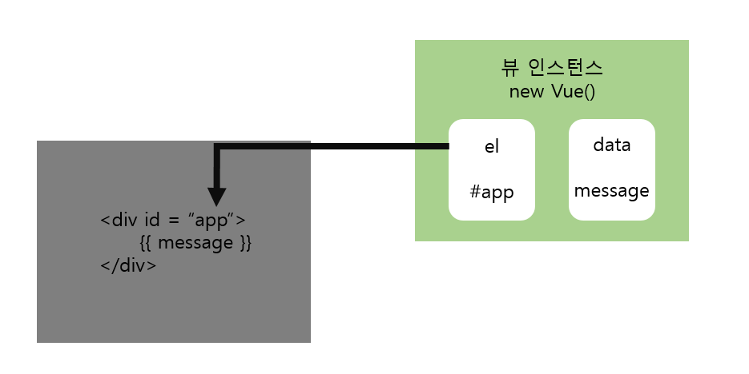
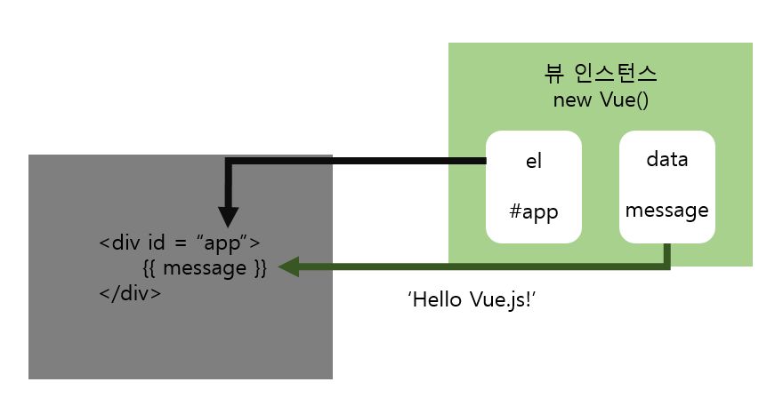
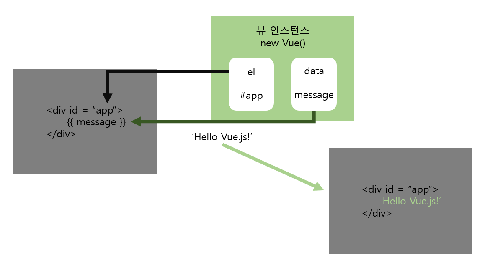
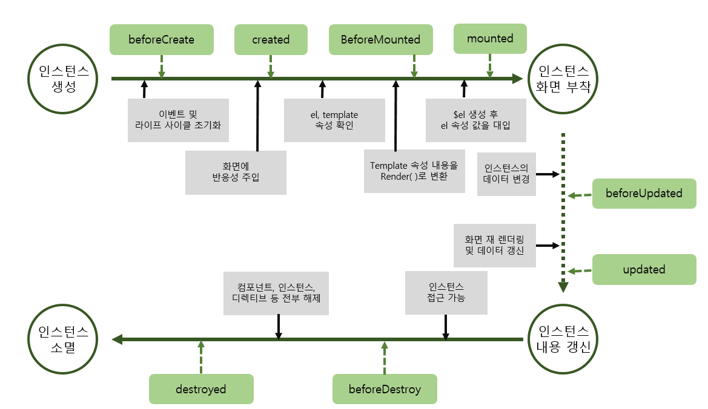

# Vue.js

## Vue.js 필수 기술 살펴보기

### 1. Vue.js 소개

#### 1-1. Vue.js란?

##### Vue.js 

- 웹페이지 화면을 개발하기 위한 프런트엔드

- 화면단 라이브러리이자 프레임 워크


[^그림1]: 점진적인 프레임워크로서의 뷰의 의미

Vue.js의 창시자 에반 유가 2017년에 발표한 프레젠테이션에서 사용한 그림.

뷰 코어 라이브러리

- 화면단 데이터 표현에 관한 기능들을 중점적으로 지언
- 프레임워크의 기능인 라우터, 상태 관리, 테스팅 등을 쉽게 결합 가능
- 즉 라이브러리의 역할 뿐만 아니라 프레임워크 역할도 할 수 있다는 의미


##### 뷰의 장점 

1. 배우기 쉽다.
2. 리액트와 앵귤러에 비해 성능이 우수하며 속도가 빠름
3. 리액트의 장점(가상돔virtual DOM 기반 렌더링 특성) + 앵귤러의 장점(바인딩 특성)


##### 뷰가 배우기 쉬운 이유

1. 앵귤러가 어려운 이유

   - 앵귤러1 : 프레임워크로서 완전한 기능을 제공하는 MVC 구조에서 출발

   - 앵귤러2 : 컴포넌트 기반(앵귤러 1 진화)
   - 이 과정에서 타입스크립트, ES6 등 배워야 함.
     - 타입스크립트 : 기존 자바스크립트에 엄격한 타입 체크를 도입한 언어. 앵귤러 2의 표준
     - ES6 : 자바스크립트의 최신 스펙. 이크마 스크립트 (ECMA Script) 2015와 동일한 용어

2. 리액트가 어려운 이유

   - ES6, JSX
     - JSX : JavaScript를 확장한 문법. JavaScript의 모든 기능이 포함되어 있으며, React "엘리먼트" 생성.

3. ES7, 웹팩 등 신기술이 마구 나오고 있음

   - 웹팩 : 웹 모듈 번들러. 최신 프런트엔드 프레임워크에서 권고하는 필수 웹 성능 개선 도구


#### 1-1. Vue.js 특징

##### UI 화면단 라이브러리

Vue.js는 UI 화면 개발 방법 중 하나인 MVVM 패턴의 뷰 모델에 해당하는 화면단 라이브러리


##### MVVM패턴 

- 모델(Model) - 뷰(View) - 뷰 모델(View Model)로 구조화 하여 개발하는 방식
- 화면의 요소들을 제어하는 코드와 데이터 제어 로직을 분리해 코드를 더 직관적으로 이해 가능
  - 화면 요소를 꾸미는 HTML, CSS코드와 데이터 베이스에서 데이터를 가져와 제어하는 Java 코드가 한 파일에 섞이면서 가독성이 현저히 떨어짐
  - 작성자 뿐 아니라 협업자들도 소스 코드를 읽는데 애를 먹었음
- 화면의 유지 보수성 높아짐

| 용어                         | 설명                                                         |
| ---------------------------- | ------------------------------------------------------------ |
| 뷰(View)                     | 사용자에게 보이는 화면                                       |
| 돔(DOM)                      | HTML 문서에 들어가는 요소(태그, 클래스, 속성 등)의 정보를 담고 있는 데이터 트리 |
| 돔 리스너(DOM Listener)      | 돔의 변경 내역에 대해 즉각적으로 반응하여 특정 로직을 수행하는 장치 |
| 모델(Model)                  | 데이터를 담는 용기. 보통은 서버에서 가져온 데이터를 자바스크립트 객체 형태로 저장 |
| 데이터 바인딩 (Data Binding) | 뷰(View)에 표시되는 내용과 모델의 데이터를 동기화            |
| 뷰 모델(View Model)          | 뷰와 모델의 중간 영역. 돔 리스너와 바인딩을 제공하는 영역    |


##### MVVM 구조의 처리 흐름


[^그림3 ]: 구글 화면단


뷰(View) : 사용자에게 비춰지는 구글 검색 화면 전체를 의미.

돔(DOM) : 화면에 나타나는 HTML 문서 상의 모든 요소를 의미.


[^그림 4]: 검색 화면단

돔 리스너(DOM Listener) : 검색 버튼을 클릭했을 시 이 클릭을 감지하여, 버튼이 동작하는 순간 검색 결과를 보여주는 로직을 처리하는 장치

데이터 바인딩(Data Binding) : 검색 결과 처리 과정에 관여. 검색 결과에 해당하는 데이터를 모델(Model)에서 가져와 화면에 나타내줌.


**이처럼 Vue.js는 화면의 요소가 변경되거나 조작이 일어날 때 즉각적으로 반응하여 화면의 데이터를 갱신하여 보여주는 역할.**

- 화면의 표현에 주로 관여하는 라이브러리이기 때문에 화면단 라이브러리라고도 함


##### 컴포넌트 기반 프레임 워크


컴포넌트 

- 레고 블럭과 같은 것.
- 뷰의 컴포넌트를 레고 블럭처럼 조합하여 화면을 구성할 수 있음
- 왼쪽 화면은 각 영역을 컴포넌트로 지정하여 구분
- 오른쪽 그림은 왼쪽 화면의 각 컴포넌트 간의 관계를 나타낸 것


##### 컴포넌트 기반 방식으로 개발하는 이유

- 코드를 재사용하기가 쉽기 때문
- Vue.js의 경우 컴포넌트를 썼을 때 HTML 코드에서 화면의 구조를 직관적으로 파악 가능
- 프레임 워크 자체에서 컴포넌트 방식을 추구하면 모두가 정해진 방식대로 컴포넌트를 활용하므로 보기에도 수월해짐 


##### 리액트와 앵귤러의 장점을 가진 프레임워크

- Vue.js는 앵귤러의 양방향 데이터 바인딩(Two-way Data Binding)과 리액트의 단방향 데이터 흐름(one-way Data Flow)의 장점을 모두 결합한 프레임워크
  - 양방향 데이터 바인딩(Two-way Data Binding) : 화면에 표시되는 값과 프레임워크의 모델 데이터 값이 동기화되어 한쪽이 변경되면 다른 한쪽도 자동으로 변경되는 것
  - 단방향 데이터 흐름(one-way Data Flow) : 컴포넌트의 단방향 통신을 의미. 컴포넌트 간에 데이터를 전달할 때 항상 상위 컴포턴트에서 하위 컴포넌트 한 방향으로만 전달하게끔 프레임워크가 구조화되어 있는 것
- 빠른 화면 렌더링(Rendering)을 위해 리액트의 가상 돔(Virtual DOM) 렌더링 방식을 적용해 사용자 인터랙션이 많은 요즘의 웹 화면에 적합한 동작 구조를 갖추고 있음
  - 가상 돔을 활용하면 특정 돔 요소를 추가하거나 삭제하는 변경이 일어날 때 화면 전체를 다시 그리지 않고 프레임워크에서 정의한 방식에 따라 화면을 갱신
  - 브라우저 입장에서는 성능 부하가 줄어들어 일반 렌더링 방식보다 더 빠르게 화면을 그림
- Vue.js는 대중적인 프레임워크인 리액트, 앵귤러의 장점을 살려 제작되었기 때문에 기존 리액트, 앵귤러 개발자도 쉽게 배울 수 있음.


### 2. 개발환경 설정 및 첫 번째 프로젝트

#### 2-1. 뷰 학습을 위한 개발 환경 설정

| 설치해야 할 도구                                             |
| ------------------------------------------------------------ |
| 크롬 브라우저<br />아톰(Atom) 텍스트 에디터 <br />노드제이에스(Node.js)<br />뷰 개발자 도구(Vue.js devtools, 크롬 확장 플러그인) |

##### 아톰(Atom) 텍스트 에디터 

- 개인적인 감상평 : Visual Studio와 비슷한 형태인 거 같은데 처음에는 조금 다루기 어려웠다. 교재가 없었다면 아마 좀 헤맸을 것 같다.

- 아톰 테마 : Seti-ui, atom-material-syntax-dark

  - 테마 설치 방법 : File - Settings - Install - Themes

  - 테마 적용 : Settings - Themes - UI Theme / Syntax Theme

- 아톰 패키지 : Settings - Install - Packages - language-vue

##### 노드제이에스

- 서버 사이드 자바스크립트.
- 서버 측에서 실행되는 자바스크립트 실행 환경
- 초창기 자바스크립트는 웹 화면의 간단한 작업을 처리하기 위한 용도로 사용되었으나 노드제이에스 덕분에 자바스크립트는 웹 뿐 아니라 서버 사이드, 사물 인터넷, 로봇 제어에도 활용되는 기반을 갖추게 되었음
- 설치 시 (버전)LTS
- cmd -> node -v 로 커맨드 입력 시 정상적으로 설치되었으면 노드제이에스의 버전이 뜸

##### 뷰 개발자 도구

- 뷰로 개발할 때 도움을 주는 도구
- 뷰로 만든 웹 앱의 구조를 간편하게 디버깅하거나 분석할 수 있음
- 검색 후 chrome web store로 들어가 팝업 페이지 상단 위쪽에 있는 크롬에 추가 버튼 클릭 - 설치 여부를 묻는 팝업 창 - 확장 프로그램 추가 버튼 누름


#### 2-2 프로젝트 만들기

##### 뷰 시작하기

HTML 파일 생성 - 뷰 소스 코드 추가 - 브라우저로 실행

```vue
<!DOCTYPE html>
<html lang="en" dir="ltr">
  <head>
    <meta charset="utf-8">
    <title>Vue Sample</title>
  </head>
  <body>
    <div id="app">
      {{ message }}
    </div>
    <script src="https://cdn.jsdelivr.net/npm/vue@2.5.2/dist/vue.js"></script>
    <script>
      new Vue({
        el : '#app',
        data: {
          message: 'Hello Vue.js!'
        }
      });
    </script>
  </body>
</html>

```

[^코드 1]: 실습 예제 1


- 이 실습 예제에서 중요한 것은 HTML 문서에서 코드 몇 줄로 뷰를 바로 실행할 수 있다는 점. (나는 아직 잘 모르겠다...)

- 크롬 브라우저를 열어 파일에 접근한 뒤 크롬 개발자 도구로 확인하면 로그가 두 개 뜬다.

  

  - 첫 번째 로그 해결 방법

    

    

  - 두 번째 로그 확인 방법

    - 개발자 도구를 열고 Vue 탭을 연다.

    - 그 뒤 '<Root>==$vm0'을 클릭하면 다음과 같은 화면이 뜬다.

    

    - 왼쪽의 텍스트가 강조되면서 오른쪽에 루트 컴포넌트에 대한 상세 내용이 표시된다.
      - 루트 컴포넌트 :  뷰 애플리케이션을 실행할 때 가장 근간이 되는 컴포넌트이자 최상위 컴포넌트를 의미
    - 그 외에 Vuex, Events, Refresh 탭을 선택해 해당 기능에 대한 상태를 쉽게 확인할 수 있다.
    - 결론적으로 화면에 표시된 텍스트는 최상위 컴포넌트의 data 속성인 message의 값인 것이다.

    

### 3. 화면을 개발하기 위한 필수 단위 - 인스턴스&컴포넌트

#### 3-1 뷰 인스턴스

##### 뷰 인스턴스의 정의와 속성

###### 뷰 인스턴스

- 뷰로 화면을 개발하기 위해 필수적으로 생성해야 하는 기본 단위
- 앞장의 'Hello Vue.js!' 텍스트가 화면에 표시된 것은 인스턴스가 있었기 때문에 가능
- 인스턴스는 뷰로 화면을 개발하기 위해 빠트릴 수 없는 필수 조건

###### 뷰 인스턴스 생성


- 뷰 인스턴스 형식

  ```vue
  new Vue({
  
  });
  ```

- 먼저 new Vue로 뷰 인스턴스 생성 - 인스턴스 내부에 el 속성으로 뷰 인스턴스가 그려질 지점 지정 - data 속성에 message 값을 정의하여 화면의 {{ message }}에 연결

###### 뷰 인스턴스 생성자

- new Vue()로 인스턴스를 생성할 시 Vue를 생성자라고 한다.

- Vue 생성자는 뷰 라이브러리를 로딩하고 나면 접근 가능

- 생성자를 사용하는 이유 : 뷰로 개발할 때 필요한 기능들을 생성자에 미리 정의해놓고 사용자가 그 기능을 재정의하여 편리하게 사용하도록 하기 위해서

  - 생성자 

    - 객체를 새로 생성할 때 자주 사용하는 옵션과 기능들을 미리 특정 객체에 저장, 새로 객체를 생성할 때 기조에 포함된 기능과 더불어 기존 기능을 쉽게 확장하여 사용하는 기법.

    - 일반적으로 객체 지향 프로그래밍에서 사용하는 객체 정의 방식으로 미리 정의된 속성과 메서드를 재활용하기 위해 사용

###### 뷰 인스턴스 옵션 속성

- 뷰 인스턴스 옵션 속성

  - 인스턴스를 생성할 때 재정의할 data, el, template 등의 속성을 의미

  - ex. Hello Vue.js! 예제에서 data라는 미리 정의되어 있는 속성을 사용한 것

    그 안에 message라는 새로운 속성을 추가한 뒤 Hello Vue.js! 라는 값을 주었음

    el 속성 역시 미리 정의되어 있는 것이며, 뷰로 만든 화면이 그려지는 시작점 의미

  - 뷰 인스턴스로 화면을 렌더링할 때 화면이 그려질 위치의 돔 요소를 지정해주어야 함

    

    #app 값은 화면의 돔 요소 중 app이라는 아이디를 가진 요소를 의미.

    여기서 사용한 # 선택자는 CSS 선택자 규칙과 같다.

- 이 외에도 templete, methods, created 등 미리 정의되어 있는 속성을 사용할 수 있음.

  | 속성      | 설명                                                         |
  | --------- | ------------------------------------------------------------ |
  | templeste | 화면에 표시할 HTML, CSS 등의 마크업 요소를 정의하는 속성.<br />뷰의 데이터 및 기타 속성들도 함께 화면에 그릴 수 있다. |
  | methods   | 화면 로직 제어와 관계된 메서드를 제어하는 속성.<br />마우스 클릭 이벤트 처리와 같이 화면의 전반적인 이벤트와 화면 동작과 관련된 로직을 추가할 수 있다. |
  | created   | 뷰 인스턴스가 생성되자마자 실행할 로직을 정의할 수 있는 속성.<br />뷰 인스턴스 라이프 사이클 부분에서 추가로 설명된다. |


###### 뷰 인스턴스의 유효 범위

**인스턴스의 유효 범위란**

- 뷰 인스턴스를 생성하면 HTML의 특정 범위 안에서만 옵션 속성들이 적용되어 나타나는 것.

- 지역 컴포넌트와 전역 컴포넌트의 차이점을 이해하기 위해서도 꼭 알아야 하는 개념

- 인스턴의 유효 범위는 el 속성과 밀접한 관계

- 인스턴스의 유효 범위를 이해하려면 인스턴스가 생성된 후 화면에 어떻게 적용되는지를 알아야 함

- new Vue()로 인스턴스를 생성하고 나서 화면에 인스턴스 옵션 속성을 적용하는 과정은 다음과 같다.

  

  [^그림 12]: 인스턴스가 화면에 적용되는 과정

  

- 이 과정을 이해하기 위해 Hello Vue.js 샘플 코드의 인스턴스 정의 부분을 자세히 살펴본다.

  ```vue
  new Vue({
    el : '#app',
    data : {
      message : 'Hello Vue.js!'
    }
  });
  ```

  // 인스턴스 옵션 속성 정의 및 인스턴스 속성

- 먼저 자바스크립트 코드 상에서 인스턴스 옵션 속성 el과 data를 인스턴스에 정의하고 new Vue()로 인스턴스를 생성 -> 브라우저에서 위 샘플 코드를 실행하면 아래와 같이 el 속성에 지정한 화면 요소(돔)에 인스턴스가 부착됨

  

- el 속성에 인스턴스가 부착되고 나면 인스턴스에 정의한 옵션 객체의 내용(data 속성)이 el 속성에 지정한 화면 요소와 그 이하 레벨의 화면 요소에 적용되어 값이 치환된다.

  

- data 속성의 message 값 Hello Vue.js! 가 {{ message }} 와 치환된다.

  

[^그림 15]: HTML 코드에 인스턴스의 내용이적용되어 최종적으로 값이 치환된 모습


###### 인스턴스의 유효 범위 확인

만약 인스턴스의 유효 범위를 벗어나면 어떻게 되는지 살펴본다.

```vue
<div id ="app">


</div>
{{ message }}
```

이 코드의 실행 결과는 다음과 같다.


message 속성의 값이 Hello Vue.js! 로 바뀌지 않고 그대로 출력되는 이유는 인스턴스의 유효 범위 때문이다.

```vue
<div id ="app">


</div> <!-- 여기까지가 인스턴스 유효 범위다. -->
{{ message }}
```


위 코드에서 인스턴스의 유효 범위는 el 속성으로 지정한 <div id="app"> 태그 아래에 오는 요소들로 제한된다. 

따라서 <div> 태그 바깥에 있는 {{ message }}는 뷰에서 인식하지 못하기 때문에 Hello Vue.js! 로 바뀌지 않고 {{ message }} 그대로 출력된다.


###### 뷰 인스턴스 라이프 사이클

인스턴스의 상태에 따라 호출할 수 있는 속성들을 라이프 사이클(life cycle) 속성이라고 한다.

- 라이프 사이클 (life cycle) : 모바일 앱을 비롯해 일반적으로 애플리케이션이 갖고 있는 생명 주기

그리고 각 라이프 사이클 속성에서 실행되는 커스텀 로직을 라이프 사이클 훅(hook)이라고 한다.

- 커스텀 로직 : 개발자가 임의로 작성한 추가 로직

라이프 사이클 속성에는 created, beforeCreate, beforeMount, mounted 등 인스턴스의 생성, 변경, 소멸과 관련하여 총 8개가 있다.



- 이 그림은 인스턴스가 생성되고 나서 화면에 인스턴스가 부착된 후 소멸되기까지의 전체적인 흐름을 나타낸 뷰 인스턴스 라이프 사이클 다이어그램이다.

- 라이프 사이클 단계를 크게 나누면 인스턴스의 생성, 생성된 인스턴스를 화면에 부착, 화면에 부착된 인스턴스의 내용이 갱신, 인스턴스가 제거되는 소멸의 4단계로 이루어진다.

- 위 그림에서 부착 -> 갱신 구간은 데이터가 변경되는 경우에만 거치게 됨
- 각 단계 사이에 라이프 사이클 속성 created, mounted, updated 등이 실행된다.
  - beforeCreate
    - 인스턴스가 생성되거 나서 가장 처음으로 실행되는 라이프 사이클 단계
    - 이 단계에서는 data 속성과 methods 속성이 아직 인스턴스에 정의되어 있지 않음
    - 돔과 같은 화면 요소에도 접근할 수 없음
  - created
    - beforeCreate 라이프 사이클 단계 다음에 실행되는 단계
    - data 속성과 methodes 속성이 정의되었기 때문에 this.data 또는 this.fetchData() 와 같은 로직들을 이용하여 data 속성과 methods 속성에 정의된 값에 접근하여 로직을 실행할 수 있다.
    - 다만 아직 인스턴스가 화면 요소에 부착되기 전이기 때문에 templete 속성에 정의된 돔 요소로 접근할 수 없다.
    - data 속성과 methods 속성에 접근할 수 있는 가장 첫 라이프 사이클 단계이자 컴포넌트가 생성되고 나서 실행되는 단계이기 때문에 서버에 데이터를 요청하여 받아오는 로직을 수행하기 좋다.
  - beforeMount
    - created 단계 이후 templete 속성에 지정한 마크업 속성을 render( ) 함수로 변환한 후 el 속성에 지정한 화면 요소(돔)에 인스턴스를 부착하기 전 호출되는 단계.
    - render( ) 함수가 호출되기 직전의 로직을 추가하기 좋다.
      - render( ) : 자바스크립트로 화면의 돔을 그리는 함수
  - mounted
    - el 속성에서 지정한 화면 요소에 인스턴스가 부착되고 나면 호출되는 단계
    - templete 속성에 정의한 화면 요소(돔)에 접근할 수 있어 화면 요소를 제어하는 로직을 수행하기 좋은 단계
    - 돔에 인스턴스가 부착되자마자 호출되기 때문에 하위 컴포넌트나 외부 라이브러리에 의해 추가된 화면 요소들이 최종 HTML 코드로 변환되는 시점과 다를 수 있다.
      - 변환되는 시점이 다를 경우 $nextTick( ) API를 활용하여 HTML 코드로 최종 파싱(변환)될 때까지 기다린 후 돔 제어 로직을 추가한다.
  - beforeUpdate
    - el 속성에서 지정한 화면 요소에 인스턴스가 부착되고 나면 인스턴스에 정의한 속성들이 화면에 치환된다.
    - 치환된 값은 뷰의 반응성(Reactivity)를 제공하기 위해 $swatch 속성으로 감시한다. (이를 데이터 관찰이라 한다.)
      - 뷰의 반응성 : 뷰의 특징 중 하나로 코드의 변화에 따라 화면이 반사적으로 반응하여 빠르게 화면을 갱신하는 것을 의미
    - 또한 beforeUpdated는 관찰하고 있는 데이터가 변경되면 가상 돔으로 화면을 다시 그리기 전에 호출되는 단계.
    - 변경 예정인 새 데이터에 접근할 수 있어 변경 예정 데이터의 값과 관련된 로직을 미리 넣을 수 있다. 만약 여기에 값을 변경하는 로직을 넣더라고 화면이 다시 그려지지는 않는다.
  - updated
    - 데이터가 변경되고 나서 가상 돔으로 다시 화면을 그리고 나면 실행되는 단계
    - 데이터 변경으로 인한 화면 요소 변경까지 완료된 시점으로, 데이터 변경 후 화면 요소 제어와 관련된 로직을 추가하기 좋은 단계
    - 이 단계에서 데이터 값을 변경하면 무한 루프에 빠질 수 있으므로 값을 변경하려면 computed, watch와 같은 속성을 사용해야 함
    - 따라서 데이터 값을 갱신하는 로직은 가급적이면 beforeUpdate에 추가하고, updated에서는 변경 데이터의 화면 요소(돔)와 관련된 로직을 추가하는 것이 좋다.
      - mounted 단계와 마찬가지로 하위 컴포넌트의 화면 요소와 외부 라이브러리에 의해 주입된 요소의 최종 변환 시점이 다를 수 있다.  $nextTick( )을 사용하여 변환이 완료될 때까지 기다렸다 로직을 추가한다.
  - beforeDestroy
    - 뷰 인스턴스가 파괴되기 직전에 호출되는 단계
    - 이 단계에서는 아직 인스턴스에 접근할 수 있다.
    - 따라서 뷰 인스턴스의 데이터를 삭제하기 좋은 단계
  - destroyed
    - 뷰 인스턴스가 파괴되고 나서 호출되는 단계
    - 뷰 인스턴스에 정의된 모든 속성이 제거되고 하위에 선언한 인스턴스 또한 모두 파괴


```vue
<!DOCTYPE html>
<html lang="en" dir="ltr">
  <head>
    <meta charset="utf-8">
    <title>Vue Instance Lifecycle</title>
  </head>
  <body>
    <div id="app">
      {{ message }}
    </div>

    <script src="https://cdn.jsdelivr.net/npm/vue@2.5.2/dist/vue.js"></script>
    <script>
      new Vue({
        el : '#app',
        data: {
          message: 'Hello Vue.js!'
        },
        beforeCreate : function() {
          console.log("beforeCreate");
        },
        created : function() {
          console.log("created");
        },
        mounted : function() {
          console.log("mounted");
        },
        updated : function() {
          console.log("updated");
        }
      });
    </script>
  </body>
</html>

```

위 코드는 뷰 시작하기 샘플 코드에서 라이프 사이클의 4개 속성인 beforeCreate, created, mounted, updated를 추가하고 각각 로그를 출력해보는 예제이다.


로그를 보면 뷰 라이플 사이클 도해의 흐름대로 beforeCreate, created, mounted가 표시되는 것을 확인할 수 있다. 다만 한가지 의아한 부분은 updated 속성 함수는 호출되지 않았다는 것이다.

그 이유는 updated 라이프 사이클 혹은 뷰 인스턴스에서 데이터 변경이 일어나 화면이 다시 그려졌을 때 호출되는 로직이기 때문이다.

그럼 updated의 앞 단계인 mounted 단계에서 기존에 정의된 data 속성의 message 값을 변경해보자.

```vue
<!DOCTYPE html>
<html lang="en" dir="ltr">
  <head>
    <meta charset="utf-8">
    <title>Vue Instance Lifecycle</title>
  </head>
  <body>
    <div id="app">
      {{ message }}
    </div>

    <script src="https://cdn.jsdelivr.net/npm/vue@2.5.2/dist/vue.js"></script>
    <script>
      new Vue({
        el : '#app',
        data: {
          message: 'Hello Vue.js!'
        },
        beforeCreate : function() {
          console.log("beforeCreate");
        },
        created : function() {
          console.log("created");
        },
        mounted : function() {
          console.log("mounted");
          this.message = 'Hello Vue!';
          <!-- message 값 변경 -->
        },
        updated : function() {
          console.log("updated");
        }
      });
    </script>
  </body>
</html>
```

mounted 단계에서 데이터를 변경했기 때문에 beforeUpdate, updated 단계에서 정의한 로직이 모두 동작한다.

다만 여기서는 updated 단계에만 'updated'라는 로그를 출력하는 커스텀 로직을 정의했기 때문에 beforeUpdate 단계에서는 아무런 동작을 하지 않는다.

일단 message 값이 변경됨에 따라 화면의 내용은 자연스럽게 갱신된 것이라고 이해하고 넘어가자.

코드를 실행하면 다음과 같은 결과 화면이 나타난다.


아까 보이지 않던 updated 로그가 출력되었다.

그 이유는 message 값이 변경되면서 화면에 표시되는 message 값이 갱신되었고, 이에 따라 updated 속성에 정의한 로직이 실행되었기 때문이다.

여기서 중요한 것은 인스턴스의 데이터가 갱신되면서 라이프 사이클 단계가 beforeUpdate, updated 단계로 진입했다는 점이다.

이처럼 각 인스턴스 라이프 사이클에 맞춰 원하는 로직을 추가하여 원하는 시점에 실행할 수 있다.

