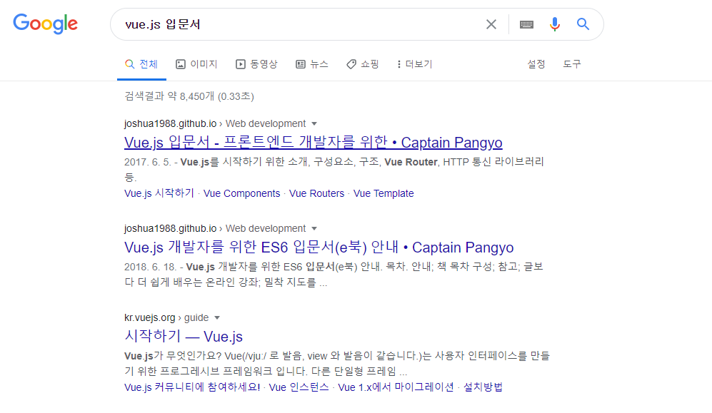

# Vue.js

## Vue.js 필수 기술 살펴보기

### 1. Vue.js 소개

#### 1-1. Vue.js란?

##### Vue.js 

- 웹페이지 화면을 개발하기 위한 프런트엔드

- 화면단 라이브러리이자 프레임 워크


[^그림1]: 점진적인 프레임워크로서의 뷰의 의미

Vue.js의 창시자 에반 유가 2017년에 발표한 프레젠테이션에서 사용한 그림.

뷰 코어 라이브러리

- 화면단 데이터 표현에 관한 기능들을 중점적으로 지언
- 프레임워크의 기능인 라우터, 상태 관리, 테스팅 등을 쉽게 결합 가능
- 즉 라이브러리의 역할 뿐만 아니라 프레임워크 역할도 할 수 있다는 의미


##### 뷰의 장점 

1. 배우기 쉽다.
2. 리액트와 앵귤러에 비해 성능이 우수하며 속도가 빠름
3. 리액트의 장점(가상돔virtual DOM 기반 렌더링 특성) + 앵귤러의 장점(바인딩 특성)


##### 뷰가 배우기 쉬운 이유

1. 앵귤러가 어려운 이유

   - 앵귤러1 : 프레임워크로서 완전한 기능을 제공하는 MVC 구조에서 출발

   - 앵귤러2 : 컴포넌트 기반(앵귤러 1 진화)
   - 이 과정에서 타입스크립트, ES6 등 배워야 함.
     - 타입스크립트 : 기존 자바스크립트에 엄격한 타입 체크를 도입한 언어. 앵귤러 2의 표준
     - ES6 : 자바스크립트의 최신 스펙. 이크마 스크립트 (ECMA Script) 2015와 동일한 용어

2. 리액트가 어려운 이유

   - ES6, JSX
     - JSX : JavaScript를 확장한 문법. JavaScript의 모든 기능이 포함되어 있으며, React "엘리먼트" 생성.

3. ES7, 웹팩 등 신기술이 마구 나오고 있음

   - 웹팩 : 웹 모듈 번들러. 최신 프런트엔드 프레임워크에서 권고하는 필수 웹 성능 개선 도구


#### 1-1. Vue.js 특징

##### UI 화면단 라이브러리

Vue.js는 UI 화면 개발 방법 중 하나인 MVVM 패턴의 뷰 모델에 해당하는 화면단 라이브러리


##### MVVM패턴 

- 모델(Model) - 뷰(View) - 뷰 모델(View Model)로 구조화 하여 개발하는 방식
- 화면의 요소들을 제어하는 코드와 데이터 제어 로직을 분리해 코드를 더 직관적으로 이해 가능
  - 화면 요소를 꾸미는 HTML, CSS코드와 데이터 베이스에서 데이터를 가져와 제어하는 Java 코드가 한 파일에 섞이면서 가독성이 현저히 떨어짐
  - 작성자 뿐 아니라 협업자들도 소스 코드를 읽는데 애를 먹었음
- 화면의 유지 보수성 높아짐

| 용어                         | 설명                                                         |
| ---------------------------- | ------------------------------------------------------------ |
| 뷰(View)                     | 사용자에게 보이는 화면                                       |
| 돔(DOM)                      | HTML 문서에 들어가는 요소(태그, 클래스, 속성 등)의 정보를 담고 있는 데이터 트리 |
| 돔 리스너(DOM Listener)      | 돔의 변경 내역에 대해 즉각적으로 반응하여 특정 로직을 수행하는 장치 |
| 모델(Model)                  | 데이터를 담는 용기. 보통은 서버에서 가져온 데이터를 자바스크립트 객체 형태로 저장 |
| 데이터 바인딩 (Data Binding) | 뷰(View)에 표시되는 내용과 모델의 데이터를 동기화            |
| 뷰 모델(View Model)          | 뷰와 모델의 중간 영역. 돔 리스너와 바인딩을 제공하는 영역    |


##### MVVM 구조의 처리 흐름


[^그림3 ]: 구글 화면단


뷰(View) : 사용자에게 비춰지는 구글 검색 화면 전체를 의미.

돔(DOM) : 화면에 나타나는 HTML 문서 상의 모든 요소를 의미.




[^그림 4]: 검색 화면단

돔 리스너(DOM Listener) : 검색 버튼을 클릭했을 시 이 클릭을 감지하여, 버튼이 동작하는 순간 검색 결과를 보여주는 로직을 처리하는 장치

데이터 바인딩(Data Binding) : 검색 결과 처리 과정에 관여. 검색 결과에 해당하는 데이터를 모델(Model)에서 가져와 화면에 나타내줌.


**이처럼 Vue.js는 화면의 요소가 변경되거나 조작이 일어날 때 즉각적으로 반응하여 화면의 데이터를 갱신하여 보여주는 역할.**

- 화면의 표현에 주로 관여하는 라이브러리이기 때문에 화면단 라이브러리라고도 함


##### 컴포넌트 기반 프레임 워크


컴포넌트 

- 레고 블럭과 같은 것.
- 뷰의 컴포넌트를 레고 블럭처럼 조합하여 화면을 구성할 수 있음
- 왼쪽 화면은 각 영역을 컴포넌트로 지정하여 구분
- 오른쪽 그림은 왼쪽 화면의 각 컴포넌트 간의 관계를 나타낸 것


##### 컴포넌트 기반 방식으로 개발하는 이유

- 코드를 재사용하기가 쉽기 때문
- Vue.js의 경우 컴포넌트를 썼을 때 HTML 코드에서 화면의 구조를 직관적으로 파악 가능
- 프레임 워크 자체에서 컴포넌트 방식을 추구하면 모두가 정해진 방식대로 컴포넌트를 활용하므로 보기에도 수월해짐 


##### 리액트와 앵귤러의 장점을 가진 프레임워크

- Vue.js는 앵귤러의 양방향 데이터 바인딩(Two-way Data Binding)과 리액트의 단방향 데이터 흐름(one-way Data Flow)의 장점을 모두 결합한 프레임워크
  - 양방향 데이터 바인딩(Two-way Data Binding) : 화면에 표시되는 값과 프레임워크의 모델 데이터 값이 동기화되어 한쪽이 변경되면 다른 한쪽도 자동으로 변경되는 것
  - 단방향 데이터 흐름(one-way Data Flow) : 컴포넌트의 단방향 통신을 의미. 컴포넌트 간에 데이터를 전달할 때 항상 상위 컴포턴트에서 하위 컴포넌트 한 방향으로만 전달하게끔 프레임워크가 구조화되어 있는 것
- 빠른 화면 렌더링(Rendering)을 위해 리액트의 가상 돔(Virtual DOM) 렌더링 방식을 적용해 사용자 인터랙션이 많은 요즘의 웹 화면에 적합한 동작 구조를 갖추고 있음
  - 가상 돔을 활용하면 특정 돔 요소를 추가하거나 삭제하는 변경이 일어날 때 화면 전체를 다시 그리지 않고 프레임워크에서 정의한 방식에 따라 화면을 갱신
  - 브라우저 입장에서는 성능 부하가 줄어들어 일반 렌더링 방식보다 더 빠르게 화면을 그림
- Vue.js는 대중적인 프레임워크인 리액트, 앵귤러의 장점을 살려 제작되었기 때문에 기존 리액트, 앵귤러 개발자도 쉽게 배울 수 있음.


### 2. 개발환경 설정 및 첫 번째 프로젝트

#### 2-1. 뷰 학습을 위한 개발 환경 설정

| 설치해야 할 도구                                             |
| ------------------------------------------------------------ |
| 크롬 브라우저<br />아톰(Atom) 텍스트 에디터 <br />노드제이에스(Node.js)<br />뷰 개발자 도구(Vue.js devtools, 크롬 확장 플러그인) |

##### 아톰(Atom) 텍스트 에디터 

- 개인적인 감상평 : Visual Studio와 비슷한 형태인 거 같은데 처음에는 조금 다루기 어려웠다. 교재가 없었다면 아마 좀 헤맸을 것 같다.

- 아톰 테마 : Seti-ui, atom-material-syntax-dark

  - 테마 설치 방법 : File - Settings - Install - Themes

  - 테마 적용 : Settings - Themes - UI Theme / Syntax Theme

- 아톰 패키지 : Settings - Install - Packages - language-vue

##### 노드제이에스

- 서버 사이드 자바스크립트.
- 서버 측에서 실행되는 자바스크립트 실행 환경
- 초창기 자바스크립트는 웹 화면의 간단한 작업을 처리하기 위한 용도로 사용되었으나 노드제이에스 덕분에 자바스크립트는 웹 뿐 아니라 서버 사이드, 사물 인터넷, 로봇 제어에도 활용되는 기반을 갖추게 되었음
- 설치 시 (버전)LTS
- cmd -> node -v 로 커맨드 입력 시 정상적으로 설치되었으면 노드제이에스의 버전이 뜸

##### 뷰 개발자 도구

- 뷰로 개발할 때 도움을 주는 도구
- 뷰로 만든 웹 앱의 구조를 간편하게 디버깅하거나 분석할 수 있음
- 검색 후 chrome web store로 들어가 팝업 페이지 상단 위쪽에 있는 크롬에 추가 버튼 클릭 - 설치 여부를 묻는 팝업 창 - 확장 프로그램 추가 버튼 누름


#### 2-2 프로젝트 만들기

##### 뷰 시작하기

HTML 파일 생성 - 뷰 소스 코드 추가 - 브라우저로 실행

```vue
<!DOCTYPE html>
<html lang="en" dir="ltr">
  <head>
    <meta charset="utf-8">
    <title>Vue Sample</title>
  </head>
  <body>
    <div id="app">
      {{ message }}
    </div>
    <script src="https://cdn.jsdelivr.net/npm/vue@2.5.2/dist/vue.js"></script>
    <script>
      new Vue({
        el : '#app',
        data: {
          message: 'Hello Vue.js!'
        }
      });
    </script>
  </body>
</html>

```

[^코드 1]: 실습 예제 1


- 이 실습 예제에서 중요한 것은 HTML 문서에서 코드 몇 줄로 뷰를 바로 실행할 수 있다는 점. (나는 아직 잘 모르겠다...)

- 크롬 브라우저를 열어 파일에 접근한 뒤 크롬 개발자 도구로 확인하면 로그가 두 개 뜬다.

  

  - 첫 번째 로그 해결 방법

    

    

  - 두 번째 로그 확인 방법

    - 개발자 도구를 열고 Vue 탭을 연다.

    - 그 뒤 '<Root>==$vm0'을 클릭하면 다음과 같은 화면이 뜬다.

    

    - 왼쪽의 텍스트가 강조되면서 오른쪽에 루트 컴포넌트에 대한 상세 내용이 표시된다.
      - 루트 컴포넌트 :  뷰 애플리케이션을 실행할 때 가장 근간이 되는 컴포넌트이자 최상위 컴포넌트를 의미
    - 그 외에 Vuex, Events, Refresh 탭을 선택해 해당 기능에 대한 상태를 쉽게 확인할 수 있다.
    - 결론적으로 화면에 표시된 텍스트는 최상위 컴포넌트의 data 속성인 message의 값인 것이다.

    

### 3. 화면을 개발하기 위한 필수 단위 - 인스턴스&컴포넌트

#### 3-1 뷰 인스턴스

##### 뷰 인스턴스의 정의와 속성

###### 뷰 인스턴스

- 뷰로 화면을 개발하기 위해 필수적으로 생성해야 하는 기본 단위
- 앞장의 'Hello Vue.js!' 텍스트가 화면에 표시된 것은 인스턴스가 있었기 때문에 가능
- 인스턴스는 뷰로 화면을 개발하기 위해 빠트릴 수 없는 필수 조건

###### 뷰 인스턴스 생성


- 뷰 인스턴스 형식

  ```vue
  new Vue({
  
  });
  ```

- 먼저 new Vue로 뷰 인스턴스 생성 - 인스턴스 내부에 el 속성으로 뷰 인스턴스가 그려질 지점 지정 - data 속성에 message 값을 정의하여 화면의 {{ message }}에 연결

###### 뷰 인스턴스 생성자

- new Vue()로 인스턴스를 생성할 시 Vue를 생성자라고 한다.

- Vue 생성자는 뷰 라이브러리를 로딩하고 나면 접근 가능

- 생성자를 사용하는 이유 : 뷰로 개발할 때 필요한 기능들을 생성자에 미리 정의해놓고 사용자가 그 기능을 재정의하여 편리하게 사용하도록 하기 위해서

  - 생성자 

    - 객체를 새로 생성할 때 자주 사용하는 옵션과 기능들을 미리 특정 객체에 저장, 새로 객체를 생성할 때 기조에 포함된 기능과 더불어 기존 기능을 쉽게 확장하여 사용하는 기법.

    - 일반적으로 객체 지향 프로그래밍에서 사용하는 객체 정의 방식으로 미리 정의된 속성과 메서드를 재활용하기 위해 사용

###### 뷰 인스턴스 옵션 속성

- 뷰 인스턴스 옵션 속성

  - 인스턴스를 생성할 때 재정의할 data, el, template 등의 속성을 의미

  - ex. Hello Vue.js! 예제에서 data라는 미리 정의되어 있는 속성을 사용한 것

    그 안에 message라는 새로운 속성을 추가한 뒤 Hello Vue.js! 라는 값을 주었음

    el 속성 역시 미리 정의되어 있는 것이며, 뷰로 만든 화면이 그려지는 시작점 의미

  - 뷰 인스턴스로 화면을 렌더링할 때 화면이 그려질 위치의 돔 요소를 지정해주어야 함

    

    #app 값은 화면의 돔 요소 중 app이라는 아이디를 가진 요소를 의미.

    여기서 사용한 # 선택자는 CSS 선택자 규칙과 같다.

    